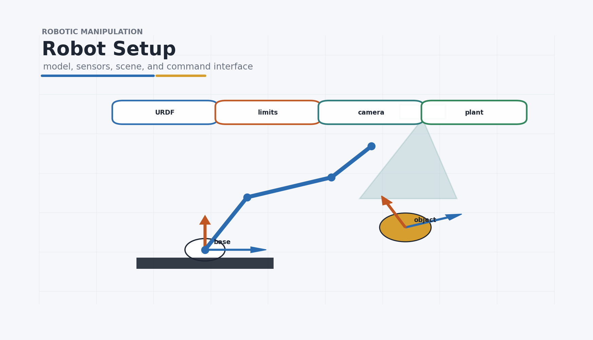

# 01 Robot Setup

在写 IK、planning 或 control 前，必须先知道软件里控制的“机器人”是什么。



一个 manipulation system 通常包含：

```text
robot model
  -> arm
  -> gripper / hand
  -> sensors
  -> scene / objects
  -> plant / simulator
  -> controller
  -> command interface
```

## Learning Objectives

- List the physical and software components of a manipulation station.
- Explain what a robot model contributes: frames, joints, limits, geometry, and inertia.
- Diagnose common algorithm failures that actually come from setup assumptions.

## Checkpoint

- You can identify the arm, gripper, sensors, scene objects, simulator, and command interface.
- You can explain the difference between visual geometry and collision geometry.
- You can name one setup mismatch that can make simulation results fail on hardware.

## Practice Task

Design a minimal pick-and-place station for a tabletop object. Write down the robot, gripper, camera, object model, controller interface, and the first calibration issue you would check.

## What The Model Defines

- `links`: 连杆。
- `joints`: 关节类型和连接关系。
- `frames`: 坐标系。
- `geometry`: 视觉几何和碰撞几何。
- `limits`: 关节角、速度、力矩限制。
- `inertia`: 质量和惯量。

## Why It Matters

很多看似算法失败的问题，本质是 setup 边界条件：

- 目标超出 workspace，IK 不可能成功。
- collision geometry 不完整，规划会穿模。
- gripper 模型和真实夹爪不一致，抓取会失败。
- 相机位姿或延迟不同，仿真成功不代表真机成功。

## Exercise

列出一个最小 pick-and-place station 需要的硬件组件：arm、gripper、camera、controller、scene object、计算机接口。
