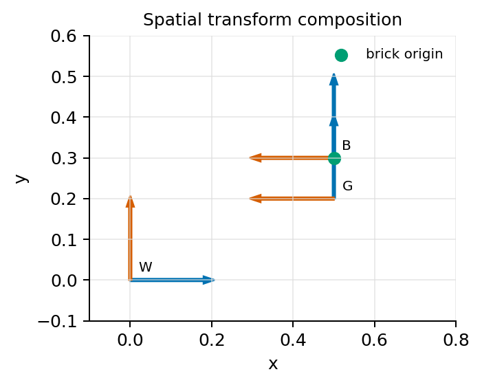
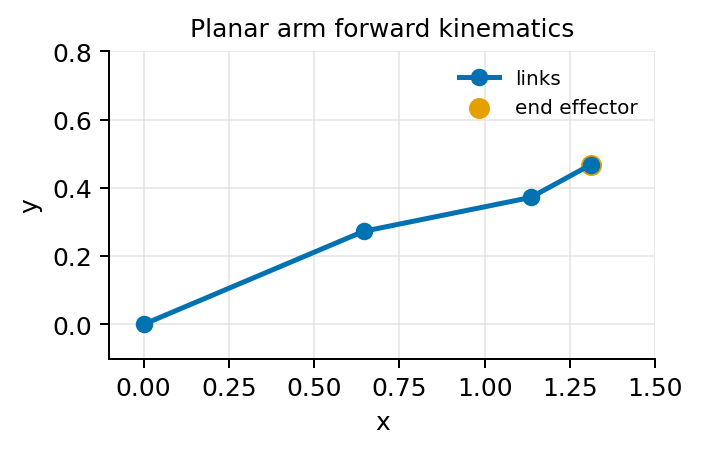
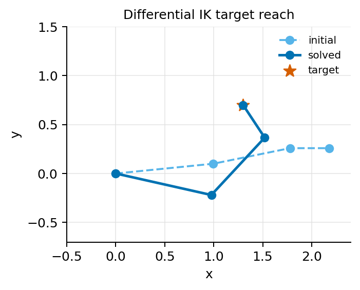
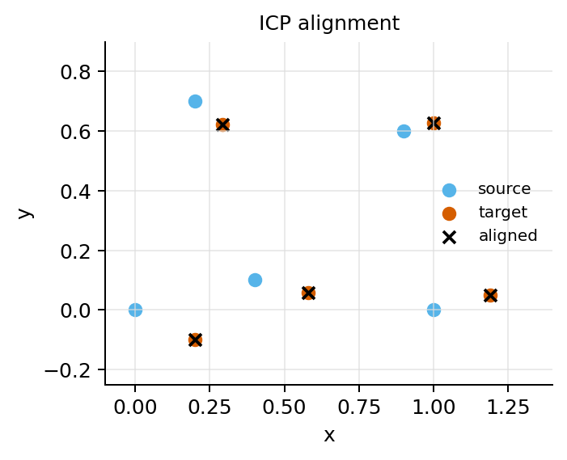
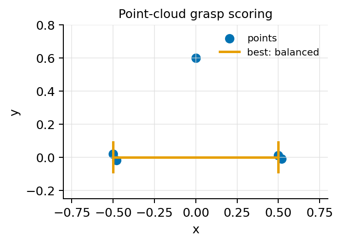
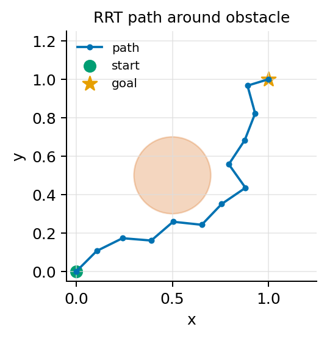
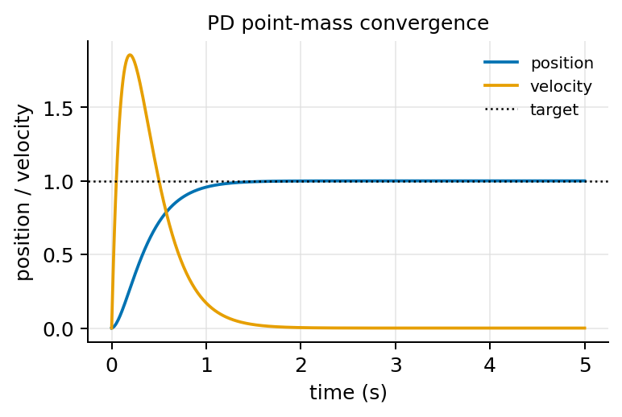
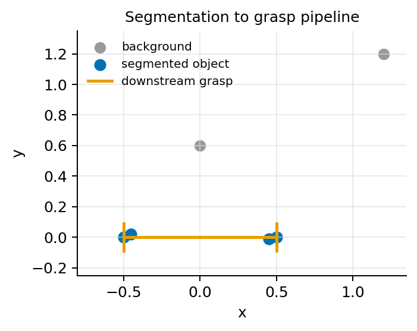
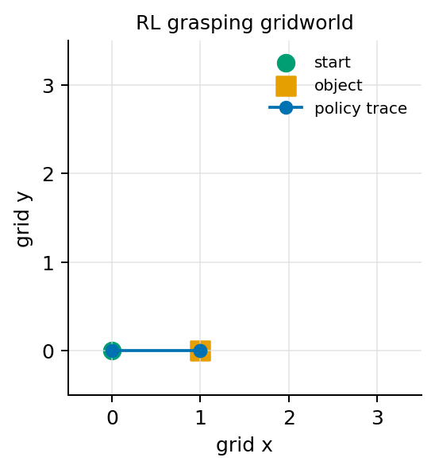

# Casebook Visual Index

These figures are generated by:

```bash
python tools/generate_casebook_figures.py docs/assets/casebook
```

They are intentionally small, deterministic, and tied to the runnable casebook scripts.

## 001 Spatial Transforms



Shows world, gripper, and brick frames after transform composition.

## 002 Forward Kinematics



Shows the planar arm links and end-effector position for a fixed joint configuration.

## 003 Differential IK



Shows the initial arm, solved arm, and target point.

## 004 ICP Pose Estimation



Shows source, target, and aligned point clouds.

## 005 Point-Cloud Grasp Scoring



Shows the target point cloud and best parallel-jaw grasp candidate.

## 006 RRT Motion Planning



Shows a collision-free path around a circular obstacle.

## 007 PD Impedance Control



Shows position and velocity convergence for a controlled unit mass.

## 008 Segmentation Pipeline



Shows how a segmentation mask selects downstream grasp points.

## 009 RL Grasping Gridworld



Shows the start, object location, and policy trace for a tiny grasping environment.

