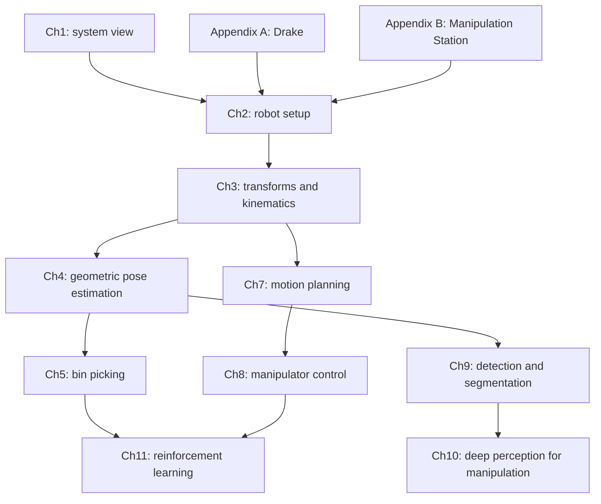

# Full Course Learning Map

This map summarizes the full local chapter set in learner-owned language. It is a teaching scaffold, not a reproduction of the source notes.

## One-Sentence Course Thesis

Robotic manipulation is the problem of making a robot reliably change object and environment state by integrating perception, geometry, planning, control, contact reasoning, simulation, and learning.

## Course Arc

| Stage | Chapters | Role in the Stack | Main Question |
| --- | --- | --- | --- |
| Motivation and system view | Preface, Ch1 | Why manipulation is hard | Why is this more than pick-and-place? |
| Robot and simulator setup | Ch2, Appendix A-B | Hardware/software substrate | What robot, hand, sensors, and simulator are we controlling? |
| Geometry and kinematics | Ch3 | Known-state manipulation | If object pose is known, how do we move the gripper? |
| Geometric perception | Ch4 | Estimate object pose | How do depth data and geometry recover pose? |
| Bin picking | Ch5 | Cluttered grasping | How do we choose grasps without fully understanding every object? |
| Mobile manipulation placeholder | Ch6 | Future extension | How does a mobile base change the planning problem? |
| Motion planning | Ch7 | Feasible motion | How do we automate collision-aware trajectories? |
| Manipulator control | Ch8 | Dynamic execution | How do planned motions become stable physical behavior? |
| Deep perception | Ch9-Ch10 | Data-driven scene understanding | How do detection, segmentation, and learned representations help manipulation? |
| Reinforcement learning | Ch11 | Learned policies | How can manipulation be framed as state, action, reward, and policy learning? |
| Practical wrap-up | Appendix C | Citation and projects | How do we cite, discuss, and extend the material? |

## Chapter-by-Chapter Teaching Notes

### Preface

The preface frames manipulation as an interaction between dynamics, perception, and control. The important takeaway is not a specific algorithm; it is the author's bias that physical reasoning matters even when perception and learning are central.

Teaching hook: manipulation is where "understanding the world" must become "changing the world."

### Chapter 1: Introduction

Chapter 1 establishes that everyday hand tasks remain difficult because they combine object recognition, pose reasoning, motion constraints, contact, uncertainty, and robust execution. It also introduces open-world variation: the robot cannot assume it has seen every possible object or kitchen.

Repository artifact: `chapters/ch01_introduction/problem_taxonomy.md`

Teaching hook: pick-and-place is the alphabet; manipulation is writing sentences in a messy physical world.

### Chapter 2: Let's Get You A Robot

This chapter grounds the rest of the course in robot models and hardware: description files, arms, hands, sensors, and simulator interfaces. The core lesson is that algorithms operate through a concrete body with joints, limits, geometry, actuators, grippers, and perception.

What to remember:

- Robot description formats encode geometry, joints, frames, and physical properties.
- Arm and hand choice changes the reachable actions.
- Sensors define what state can be estimated.
- Simulation needs a plant, scene, sensors, controllers, and commands.

Teaching hook: before asking "what algorithm?", ask "what body and what observations?"

### Chapter 3: Basic Pick And Place

This is the geometry and kinematics foundation. The chapter assumes object pose is known and focuses on transforms, notation, forward kinematics, Jacobians, differential IK, grasp/pre-grasp poses, and pick-and-place trajectories.

Repository artifacts:

- `casebook/001_spatial_transforms_numpy`
- `casebook/002_forward_kinematics_planar_arm`
- `casebook/003_differential_ik`

What to remember:

- Frame notation prevents silent coordinate bugs.
- Forward kinematics maps joint coordinates to gripper pose.
- Jacobians map joint velocity to task-space velocity.
- Differential IK is local and must handle singularity and step-size issues.
- Pick-and-place is a sequence of geometric subgoals, not just one command.

Teaching hook: most early manipulation bugs are coordinate bugs pretending to be control bugs.

### Chapter 4: Geometric Pose Estimation

This chapter removes the unrealistic assumption that object pose is known. It uses depth sensing, geometry representations, point clouds, registration, ICP, partial-view handling, free-space constraints, and tracking.

Repository artifact: `casebook/004_icp_pose_estimation`

What to remember:

- Depth cameras turn scenes into geometric observations.
- Point clouds are useful but incomplete and noisy.
- ICP alternates matching and transform estimation; it is powerful but local.
- Partial views and outliers require constraints beyond pure nearest-neighbor matching.
- Tracking reuses temporal structure instead of solving from scratch every frame.

Teaching hook: perception is not "seeing the object"; it is producing the state estimate that action needs.

### Chapter 5: Bin Picking

Bin picking is a practical bridge problem: the robot moves unknown or varied objects between bins. The chapter uses clutter generation, contact simulation, model-based grasping, point-cloud grasp scoring, corner cases, and task-level programming.

Repository artifact: `casebook/005_point_cloud_grasp_scoring`

What to remember:

- Bin picking is both an application and a data-generation setup.
- Full object understanding is often unnecessary for a useful grasp.
- Contact simulation details matter because grasps succeed or fail through contact.
- Task-level logic must handle failed grasps, empty bins, occlusion, and retries.

Teaching hook: a good bin-picking system is not one perfect grasp; it is a loop that keeps making reasonable attempts.

### Chapter 6: Mobile Manipulation

The local PDF is only a placeholder. In the course arc, this topic would connect base motion, arm reachability, collision constraints, and environment variation.

Teaching hook: moving the base changes the robot's workspace, but also expands the planning problem.

### Chapter 7: Motion Planning

This chapter adds automated trajectory generation when hand-written gripper scripts are insufficient. It covers inverse kinematics, kinematic trajectory optimization, sampling-based planning, time-optimal path parameterization, and graphs of convex sets.

Repository artifact: `casebook/006_rrt_motion_planning`

What to remember:

- IK solves goal feasibility; planning solves path feasibility.
- Sampling-based planning explores space without requiring a full convex formulation.
- Trajectory optimization searches for smooth, constrained paths.
- Time parameterization turns a geometric path into executable timing.
- Convex-set methods can expose structure in complicated planning spaces.

Teaching hook: a pose goal answers "where"; planning answers "how do I get there without breaking constraints?"

### Chapter 8: Manipulator Control

This chapter shifts from planned motion to executed motion. It starts with point-mass intuition, then moves toward general manipulator control and contact-rich tasks such as peg-in-hole.

Repository artifact: `casebook/007_pd_impedance_control`

What to remember:

- Control is about dynamic response, not just geometry.
- PD behavior gives mass-spring-damper intuition.
- Real manipulators require dynamics-aware control.
- Contact tasks often need compliant behavior rather than rigid position tracking.

Teaching hook: planning gives the desired story; control handles the physical negotiation.

### Chapter 9: Object Detection And Segmentation

This chapter introduces deep perception for scene-level questions that pure geometry struggles with: whether an object is present, where it is, and which pixels or points belong to it.

Repository artifact: `casebook/008_segmentation_pipeline_stub`

What to remember:

- Detection and segmentation can gate geometric pose estimation and grasp selection.
- Data scale and labeling quality matter.
- Learned perception complements geometry rather than replacing it.
- Downstream manipulation failures can start as upstream mask errors.

Teaching hook: segmentation is useful because it tells geometric algorithms what part of the world to care about.

### Chapter 10: Deep Perception For Manipulation

This chapter asks what perception targets are specific to manipulation: learned pose estimation, learned grasp selection, dense descriptors, task-level state, and other useful scene representations.

Repository artifact: `casebook/008_segmentation_pipeline_stub`

What to remember:

- Generic computer vision outputs are not always the right manipulation state.
- Manipulation may need affordances, grasp quality, object state, or task progress.
- Pretraining and fine-tuning are practical tools, but task-specific data still matters.

Teaching hook: the right perception output is the one that makes the next action easier.

### Chapter 11: Reinforcement Learning

This chapter frames manipulation through RL: environment interfaces, policy-gradient methods, value-based methods, and model-based RL. The key is not that RL magically solves manipulation; it gives a language for learning actions from interaction.

Repository artifact: `casebook/009_rl_grasping_gridworld`

What to remember:

- RL starts with state, action, reward, transition, and policy definitions.
- Manipulation is attractive for RL because contact-rich behaviors can be hard to script.
- Manipulation is hard for RL because data, rewards, safety, and generalization are difficult.
- Model-based RL can exploit structure instead of learning everything from scratch.

Teaching hook: RL is useful when the robot needs to improve through interaction, but the environment definition determines what it can learn.

### Appendix A: Drake

Drake is the software backbone for the course. The appendix points toward pydrake, online notebooks, local installation, and help resources.

Teaching hook: Drake is not the concept; it is the lab bench for testing the concepts.

### Appendix B: Manipulation Station

This appendix connects simulation to a concrete hardware setup: message passing, a KUKA iiwa arm, a Schunk WSG gripper, Realsense depth cameras, and supporting hardware.

Teaching hook: a manipulation stack becomes real only when software assumptions meet hardware interfaces.

### Appendix C: Miscellaneous

This appendix covers citation, annotation etiquette, final projects, and feedback. For this repository, the citation guidance is the most important practical item.

Teaching hook: keep the learning artifacts yours, and cite the source notes clearly.

## Dependency Graph

## How I Should Teach This

1. Start with the manipulation stack and task taxonomy.
2. Use one concrete task throughout: pick a known object, then remove assumptions one by one.
3. For each chapter, answer: what assumption did this chapter remove?
4. Use casebook scripts as small live examples.
5. Only introduce Drake when the conceptual API is clear.

