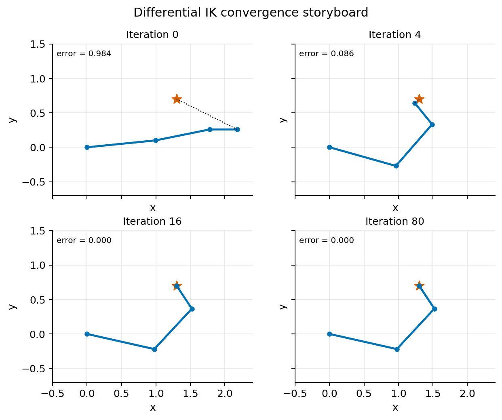
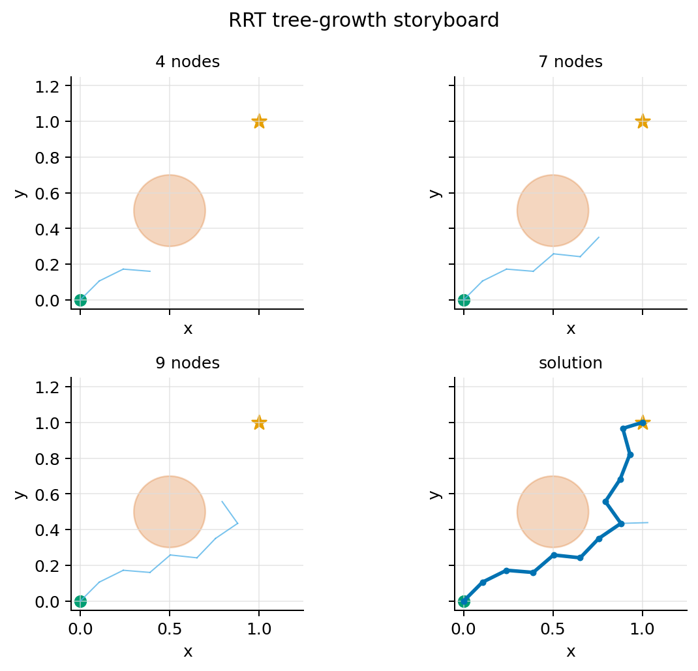

# Process Visualizations

These storyboards show how selected algorithms evolve over time. They complement the static casebook figures in `docs/casebook_visual_index.md`.

Generate them with:

```bash
python tools/generate_casebook_figures.py --storyboards docs/assets/storyboards
```

Generate both static casebook figures and storyboards with:

```bash
python tools/generate_casebook_figures.py --all docs/assets/casebook docs/assets/storyboards
```

## 003 Differential IK



Read this figure from left to right, top to bottom:

- The dotted line is the task-space residual between the current end effector and the target.
- The solver moves quickly when the Jacobian points in a useful task direction.
- Near the target, the residual shrinks and the later snapshots become visually stable.

Study prompt:

- Change the initial joint angles in `casebook/003_differential_ik/run.py`.
- Re-run the case and ask whether the solver still converges from that posture.
- Compare failure cases against the Jacobian condition and reachable workspace.

## 006 RRT Motion Planning



Read this figure as a planner trace:

- Early nodes explore from the start configuration.
- Invalid straight-line edges through the obstacle are rejected.
- Once a branch reaches the upper-right side of the obstacle, the planner can connect to the goal.

Study prompt:

- Increase the obstacle radius in `casebook/006_rrt_motion_planning/run.py`.
- Re-run the planner with different seeds and compare how exploration changes.
- Connect this 2D example to configuration-space planning in Chapter 7.
